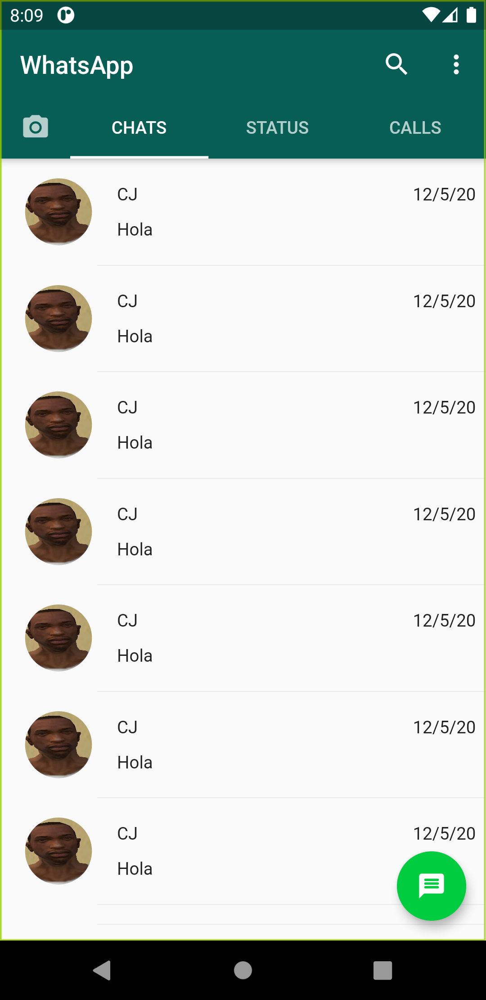

# Whatsapp_clone

A new Flutter project.

## Objectives
- Create design of whatsapp
- Create chat
- Create Login with Google and Apple
- Use state management getX

### Design

- Chats Page

For help getting started with Flutter, view our
[online documentation](https://flutter.dev/docs), which offers tutorials,
samples, guidance on mobile development, and a full API reference.
